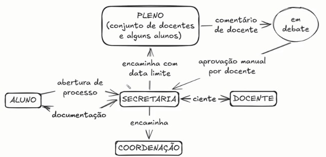

# Documentação Técnica de Transição ⬇️
## Setup, Ambiente e Infraestrutura ⚙️

Neste documento se encontram as especificações técnicas da arquitetura, o guia de implantação do ecossistema do **AcadFlow**, as funcionalidades desenvolvidas pela Equipe 7 durante a disciplina e as principais regras de negócio do sistema. O objetivo é permitir que outra equipe consiga dar continuidade ao projeto sem conhecimento prévio sobre o que foi desenvolvido.

> **Contexto:** o AcadFlow é um projeto que já existia antes da Equipe 7. O que está descrito aqui cobre apenas as evoluções realizadas pela equipe durante o semestre, sobre uma base de código preexistente.

---

## 0. Identificação do Projeto e da Equipe 👥

| Campo | Informação |
| :--- | :--- |
| **Nome do sistema** | AcadFlow — PPGEC |
| **Repositório GitHub** | https://github.com/ldhonorato/PPGEC_rec |
| **Disciplina** | Engenharia de Software |
| **Período** | 2026.1 |
| **Quadro Trello** | https://trello.com/b/BusBLA15/esw-sistema-de-gestao-de-processos |

### Equipe 7

| Membro | GitHub |
| :--- | :--- |
| Bruno Morato (PO) | brunomoratow |
| Davi de Oliveira | DaveOlivae |
| Ellen Beatryz | ellenbeatryzbarone |
| Guilherme Valença | gpvalencaa |
| Isabella Nascimento | isabella-sn |
| Matheus Albuquerque | matheus-albuquerque-dev |

---

## 1. Visão Geral da Infraestrutura e Contêineres 📦

A aplicação é totalmente orquestrada através do **Docker Compose**, onde cada serviço roda em um ambiente isolado dentro de uma rede virtual privada:

* **Gunicorn (Servidor WSGI):** Recebe as requisições HTTP e as processa através da aplicação Django. Arquivos estáticos são servidos pelo **WhiteNoise**, sem necessidade de Nginx na stack.
* **Django (Aplicação Core):** Concentra a lógica de negócios, controle de rotas, autenticação, ORM e renderização de páginas.
* **PostgreSQL (Banco de Dados):** Instância relacional responsável pela persistência de dados. Em desenvolvimento local sem Docker, o sistema usa SQLite automaticamente.
* **Redis & Celery (Processamento Assíncrono):** Tarefas como disparos de e-mails via SMTP são enviadas ao **Redis** e processadas em background pelo **Celery Worker** e **Celery Beat**, evitando travamentos na navegação.
* **pgAdmin:** Interface web para administração visual do banco PostgreSQL, acessível na porta 5050.

> **Nginx:** Em produção, o DTI (Departamento de Tecnologia da Informação) gerencia um **Nginx Proxy Manager** externo à stack Docker, que faz o proxy reverso para a aplicação. Os contêineres da aplicação **não incluem Nginx** — ele é infraestrutura da universidade, não da equipe.

Existem dois arquivos de orquestração:

| Arquivo | Contexto | Diferença principal |
| :--- | :--- | :--- |
| `docker-compose.yml` | **Desenvolvimento local** | Faz build a partir do código local (`build: .`). Porta do app: **8000**. |
| `docker-compose-prod.yml` | **Produção** | Puxa imagem publicada no GitHub Container Registry (`ghcr.io/ldhonorato/ppgec_rec:latest`). Porta: **8001**. Inclui **Watchtower** para atualizações automáticas de imagem. |

---

## 2. Stack Tecnológica e Ferramentas 📝

| Tecnologia / Ferramenta | Versão | Escopo | Finalidade na Solução |
| :--- | :--- | :--- | :--- |
| **Python** | 3.11 | Backend | Linguagem principal |
| **Django** | 5.2 | Backend / API Core | Rotas, ORM, autenticação, admin, regras de negócio |
| **Gunicorn** | latest | Servidor WSGI | Processa requisições HTTP em produção |
| **WhiteNoise** | 6.4.0 | Servidor de estáticos | Serve CSS/JS/imagens sem Nginx |
| **PostgreSQL** | 16-alpine | Banco de Dados | Persistência estruturada em Docker/produção |
| **SQLite** | embutido | Banco de Dados | Alternativa local sem Docker (automático) |
| **Redis** | 7-alpine | Message Broker | Fila de tarefas assíncronas para o Celery |
| **Celery Worker** | 5.4.0 | Gerenciador de Filas | Execução de background tasks (e-mails) |
| **Celery Beat** | 5.4.0 | Agendador | Execução de tarefas periódicas |
| **django-celery-results** | 2.5.1 | Resultados | Persiste resultados das tasks no banco |
| **psycopg2-binary** | 2.9.10 | Driver | Conexão Python ↔ PostgreSQL |
| **pgAdmin 4** | 8 (imagem) | Admin DB | Interface web de administração do PostgreSQL |
| **Watchtower** | 1.7.1 | DevOps (prod) | Auto-atualização de imagens Docker em produção |
| **Docker / Compose** | v2 | Infraestrutura | Conteinerização e orquestração de serviços |
| **python-dotenv** | 1.0.0 | Configuração | Carregamento de variáveis de ambiente do `.env` |

---

## 3. Variáveis de Ambiente (.env) 🔑

É obrigatória a existência de um arquivo `.env` na raiz do projeto (mesmo nível do `docker-compose.yml`) para viabilizar o funcionamento dos serviços.

> ⚠️ **Segurança:** Nunca versione o `.env` no repositório. Nunca compartilhe `EMAIL_HOST_PASSWORD` em PRs, issues ou canais públicos — é uma credencial real de produção.

```env
#---CONFIGURAÇÕES DO NÚCLEO DA APLICAÇÃO (DJANGO)---
DEBUG=True
SECRET_KEY=[chave_secreta_local_desenvolvimento]
SITE_URL=http://127.0.0.1:8000

#---CONFIGURAÇÕES DO BANCO DE DADOS (POSTGRESQL)---
POSTGRES_DB=[nome_do_banco_de_dados]
POSTGRES_HOST=db
POSTGRES_PASSWORD=[senha_do_usuario_postgres]
POSTGRES_PORT=5432
POSTGRES_USER=[usuario_do_banco_de_dados]

#---CONFIGURAÇÕES DE ENVIO DE E-MAIL (SMTP)---
DEFAULT_FROM_EMAIL=[email_remetente_padrao]
EMAIL_HOST=smtp.gmail.com
EMAIL_HOST_PASSWORD=[senha_de_app_gmail_16_chars]
EMAIL_HOST_USER=[usuario_do_servidor_smtp]
EMAIL_PORT=587
EMAIL_USE_TLS=True

#---CONFIGURAÇÕES DO PGADMIN---
PGADMIN_DEFAULT_EMAIL=[email_valido_para_login_no_pgadmin]
PGADMIN_DEFAULT_PASSWORD=[senha_do_pgadmin]

#---CONFIGURAÇÕES DE FILAS E PROCESSAMENTO ASSÍNCRONO (CELERY)---
# Normalmente não precisam ser definidas no .env para uso local com Docker,
# pois já estão configuradas no docker-compose.yml
CELERY_BROKER_URL=redis://redis:6379/0
CELERY_RESULT_BACKEND=redis://redis:6379/0
```

> **Sobre `EMAIL_HOST_PASSWORD`:** O sistema usa Gmail com **Senha de App** — não é a senha da conta Google. Gere em: Conta Google → Segurança → Verificação em duas etapas → Senhas de app. O resultado é uma sequência de 16 caracteres.

> **Sobre `PGADMIN_DEFAULT_EMAIL`:** O pgAdmin 4.8+ valida o formato do e-mail. Use um endereço com domínio válido (ex.: `admin@ppgec.com`), não `.local`.

---

## 4. Passo a Passo: Configuração e Execução 🚀

### 4.1 Pré-requisitos

Instale apenas:
- [Docker Desktop](https://www.docker.com/products/docker-desktop/) (Windows/macOS) ou Docker Engine + Docker Compose v2 (Linux)
- Git

Não é necessário instalar Python, PostgreSQL ou Redis localmente.

### 4.2 Clonar o repositório

```bash
git clone https://github.com/ldhonorato/PPGEC_rec
cd PPGEC_rec
```

### 4.3 Criar o arquivo `.env`

Copie o template da seção 3 e preencha com os valores reais. Salve como `.env` na raiz do projeto.

### 4.4 Subir os contêineres

```bash
docker compose up --build
```

Aguarde até aparecer nos logs: `Booting worker with pid` (serviço `web`).

### 4.5 Aplicar as migrações *(apenas na primeira vez)*

```bash
docker compose exec web python manage.py migrate
```

### 4.6 Criar superusuário *(apenas na primeira vez)*

```bash
docker compose exec web python manage.py createsuperuser
```

### 4.7 Acessar o sistema

| Interface | URL |
| :--- | :--- |
| Aplicação principal | http://localhost:8000 |
| Painel Admin Django | http://localhost:8000/admin/ |
| pgAdmin (banco) | http://localhost:5050 |

### 4.8 Comandos úteis

```bash
# Parar todos os serviços
docker compose down

# Parar e apagar volumes (apaga o banco de dados)
docker compose down -v

# Ver logs em tempo real
docker compose logs -f web

# Criar novas migrações após alterar models.py
docker compose exec web python manage.py makemigrations

# Acessar shell Django
docker compose exec web python manage.py shell
```

---

## 5. Criação de Usuários de Teste 👥

Acesse o Admin Django em http://localhost:8000/admin/ com o superusuário criado no passo 4.6.

| Perfil | Onde cadastrar no Admin | Observação |
| :--- | :--- | :--- |
| **Aluno** | Processos → Alunos | Requer TrajetoriaAcademica ativa |
| **Docente** | Processos → Docentes | Marcar `coordenador=True` para perfil Coordenador |
| **Servidor (Secretaria)** | Processos → Users | tipo_usuario = SERVIDOR |

> **Importante:** Para que os fluxos funcionem corretamente, o Aluno deve ter uma **TrajetoriaAcademica ativa** com orientador vinculado. Cadastre em: Processos → Trajetoria academicas.

**Fluxo mínimo para testar:**
1. Criar um Docente
2. Criar um Aluno
3. Criar uma TrajetoriaAcademica vinculando Aluno ao Docente (status = ATIVA)
4. Criar um Setor chamado "Secretaria" — e configurar o campo **email** do setor para receber notificações
5. Criar um Setor chamado "Pleno" (para testar encaminhamentos)
6. Logar como Aluno e abrir um processo

> **Não há credenciais de teste compartilhadas versionadas no projeto.** Os usuários de teste devem ser criados via Admin Django conforme o fluxo mínimo acima. Credenciais de ambientes já configurados devem ser solicitadas ao responsável do projeto por canal privado (nunca compartilhadas em PR, issue ou canal público).

---

## 6. Funcionalidades Desenvolvidas pela Equipe 7 🛠️

> **Contexto:** O projeto já existia antes da Equipe 7. Esta seção cobre apenas as evoluções realizadas durante o semestre sobre a base de código preexistente.

### 6.1 Épico 1 — Notificações por E-mail (entregue ✅)

Implementação completa do sistema de notificações assíncronas via Celery + Gmail SMTP. Todos os e-mails são processados em background (sem bloquear a requisição web) e incluem o nome do aluno no assunto para facilitar o filtro na caixa de entrada.

Veja a tabela completa de eventos e destinatários na seção **7.7 Notificações por E-mail**.

### 6.2 Infraestrutura e DevOps (entregue ✅)

- Criação do `docker-compose.yml` com todos os serviços (web, db, redis, celery, celery-beat, pgadmin)
- Criação do `docker-compose-prod.yml` com Watchtower para auto-update de imagens
- Migração do banco de dados de SQLite para PostgreSQL 16
- Publicação da imagem Docker no GitHub Container Registry (`ghcr.io`)
- Disponibilização do container na porta 8001 em produção
- Apoio ao DTI na configuração do Nginx Proxy Manager externo
- Merge final e resolução de conflitos com a branch da equipe anterior

### 6.3 Épico 2 — Automação do Pleno (não entregue ❌ — código parcial existe)

O Épico 2 planejava automatizar o fluxo do Pleno. **Nenhuma das features do Épico 2 está ativa em produção**, mas partes do código foram escritas e permanecem no repositório. A próxima equipe **não precisa partir do zero** nessas funcionalidades:

| Feature | Status | O que existe no código |
| :--- | :--- | :--- |
| **Encaminhamento ao Pleno com data limite** | Revertido | Campo `prazo_pleno` no `EncaminhamentoForm`; `Processo.encaminhar()` aceita e valida `prazo_limite`. |
| **Date picker visual no formulário** | Bug ativo | Campo existe no backend mas nunca aparece na tela — erro de nome no template (Bug #1). |
| **Notificação de intervenção no Pleno** | Task existe, automação inativa | `send_email_processo_comentado_pleno` está implementada e funcional. Lógica de cancelamento da automação não concluída. |
| **Worker autônomo — aprovação silenciosa** | Revertido / comentado | `verificar_prazos_expirados` em `tasks.py` está comentado. Lógica completa existe, mas foi desativada antes do go-live. |

> **Resumo:** O Épico 2 foi um trabalho **extra-escopo** — não estava previsto no escopo da disciplina e foi alinhado diretamente com o professor Leandro Honorato. Por não fazer parte das entregas obrigatórias do semestre, não foi concluído: o que existe é código parcial (revertido ou comentado) das features acima. A próxima equipe pode retomar a partir do código existente, mas precisa tratá-lo como ponto de partida não validado — não como funcionalidade pronta.

Estas features constituem, junto com os itens abaixo, o backlog não realizado do projeto — o ponto de partida para a próxima equipe:

- Adicionar `bind=True` e retry nas tasks de e-mail de setor (`processos/tasks.py`), que hoje não re-tentam em caso de falha de SMTP (e-mail de setor pode ser perdido).
- Corrigir o timeout do Gunicorn (`--timeout 120`) no `docker-compose.yml`, que hoje usa o padrão de 30s.
- Ajustar a rota de teste de e-mail (`/teste-email/`), com remetente/destinatário fixos inválidos (`processos/views.py`, função `teste_email`) — endpoint de desenvolvimento, fora dos fluxos reais.
- Reativar/definir o destinatário do e-mail de ciência efetivada para a Secretaria (task comentada em `tasks.py`).

---

## 7. Regras de Negócio 📋

> **Nota sobre escopo:** Estas regras descrevem o comportamento do sistema como um todo, incluindo módulos herdados da base preexistente e de outras equipes — não apenas o que a Equipe 7 desenvolveu. Para o que foi entregue especificamente pela Equipe 7, veja a Seção 6.

### 7.1 Perfis e Permissões

| Ação | Aluno | Docente | Coordenador¹ | Servidor |
| :--- | :---: | :---: | :---: | :---: |
| Abrir processo | ✅ | ❌ | ❌ | ❌ |
| Ver processos próprios | ✅ | — | — | — |
| Ver processos de orientandos | ❌ | ✅ | ✅ | ✅ |
| Gerenciar caixa de entrada | ❌ | ❌ | ✅² | ✅ |
| Encaminhar processo | ❌ | ❌ | ✅² | ✅ |
| Solicitar ciência do orientador | ❌ | ❌ | ✅² | ✅ |
| Deferir / Indeferir | ❌ | ❌ | ✅² | ✅ |
| Comentar no processo (Pleno) | ❌ | ✅³ | ✅ | ✅ |
| Dar ciência (orientador) | ❌ | ✅⁴ | ✅⁴ | ❌ |

> ¹ Coordenador = Docente com `docente.coordenador = True`  
> ² Apenas quando o processo está na caixa da Coordenação ou do Pleno  
> ³ Docentes sem cargo de coordenador só podem **comentar** em processos `EM_DEBATE` — não podem encaminhar nem deferir  
> ⁴ Apenas o orientador responsável pelo processo pode confirmar ou recusar a ciência

### 7.2 Ciclo de Vida de um Processo



```
[Aluno abre]
      ↓
  EM_ANÁLISE
      ↓ (Secretaria/Coordenação encaminha)
  EM_ANÁLISE  ←→  AGUARDANDO_DOCUMENTO
      ↓ (Secretaria solicita ciência do orientador)
  AGUARDANDO_CIÊNCIA
      ↓ (Orientador confirma ou recusa)
  EM_ANÁLISE
      ↓ (encaminhado ao Pleno)
  EM_DEBATE
      ↓ (Secretaria/Coordenação defere ou indefere)
  FINALIZADO
```

Regras importantes:
- **Não é possível encaminhar um processo finalizado.**
- **Não é possível encaminhar com ciência do orientador pendente** — o encaminhamento é bloqueado até a manifestação.
- Ao deferir ou indeferir, um **termo de finalização** é obrigatório.

### 7.3 Numeração de Processos

O número é gerado automaticamente no formato `YYYYMM-NNNNNN` (ex.: `202507-000001`). A sequência reinicia a cada mês. A geração é protegida por `select_for_update` para evitar duplicatas em concorrência.

### 7.4 Solicitação de Ciência do Orientador

- Só pode ser solicitada por **Servidor** ou **Coordenador**.
- Só pode existir **uma solicitação pendente por vez** por processo.
- O processo muda para status `AGUARDANDO_CIÊNCIA` automaticamente ao solicitar.
- Ao orientador confirmar ou recusar, o processo volta para `EM_ANÁLISE`.
- O orientador responsável é determinado pela **TrajetoriaAcademica ativa** do aluno criador do processo.

### 7.5 Documentos e Restrição de Acesso

Documentos podem ser marcados com 7 categorias de restrição baseadas na Lei de Acesso à Informação (Lei 12.527/2011):

| Quem pode visualizar um documento restrito |
| :--- |
| Quem enviou o documento |
| Servidor (Secretaria) — acesso irrestrito |
| Coordenador (`docente.coordenador = True`) |

Alunos e Docentes comuns **não veem** documentos restritos de outros. A remoção de um arquivo exige motivo obrigatório e é rastreada (quem removeu, quando, por quê).

### 7.6 Trajetória Acadêmica e Orientador

O vínculo entre Aluno e Orientador **não fica no modelo Aluno** — fica em `TrajetoriaAcademica`. Isso tem impacto direto em queries:

```python
# ✅ Correto
Aluno.objects.filter(
    trajetorias__orientador=request.user,
    trajetorias__status=TrajetoriaAcademica.Status.ATIVA,
).distinct()

# ❌ Errado — campo não existe mais
Aluno.objects.filter(orientador=request.user)
```

Um aluno pode ter múltiplas trajetórias (ex.: após reingresso), mas apenas **uma ativa por vez** governa o vínculo atual com orientador.

### 7.7 Notificações por E-mail

Os e-mails são disparados de forma **assíncrona via Celery** (não bloqueiam a requisição web). O nome do aluno é incluído em todos os assuntos para facilitar o filtro na caixa de entrada.

> **Remetente institucional:** Todos os e-mails do sistema são enviados a partir do endereço institucional **`acadflow@ecomp.poli.br`**, configurado na variável `EMAIL_HOST_USER` do arquivo `.env`. Esse é o endereço que aparece no campo "De:" das notificações recebidas por alunos, orientadores, setores e docentes.

**Resumo por evento — quem recebe e-mail em cada ação:**

> ⚠️ **Importante:** uma única ação no sistema pode disparar **vários e-mails simultaneamente** para destinatários diferentes. A tabela abaixo mostra o fan-out completo de cada evento (validado no código-fonte).

| Ação no sistema | Quem recebe e-mail | Tasks disparadas | Local no código |
| :--- | :--- | :--- | :--- |
| **Abertura de processo** | Aluno criador · Orientador · Secretaria (setor inicial) | `novo_processo_aluno` + `novo_processo_orientador` + `novo_processo_secretaria` | views.py:1909-1911 / 2513-2515 / 2576-2578 |
| **Encaminhamento para setor comum** | Aluno criador · Orientador · Setor de destino | `movimentacao_aluno` + `movimentacao_orientador` + `mudanca_setor` | views.py:1680-1685 |
| **Encaminhamento ao Pleno** | Aluno criador · Orientador · Setor de destino · **Todos os docentes** | `movimentacao_aluno` + `movimentacao_orientador` + `mudanca_setor` + `movimentacao_pleno` | views.py:1680-1685 |
| **Devolução ao requerente** | Aluno criador · Orientador | `devolucao_requerente` + `movimentacao_orientador` | views.py:1677-1678 + 1685 |
| **Solicitação de ciência** | Orientador responsável | `solicitacao_ciencia` | views.py:1595 |
| **Manifestação de ciência** (muda status, não muda setor) | Setor atual (via `setor.email`) | `status_atualizado` | views.py:1622-1627 |
| **Comentário/intervenção no Pleno** | Todos os docentes | `processo_comentado_pleno` | views.py:1756 |
| **Finalização (deferido/indeferido)** | Aluno criador · Orientador | `conclusao_aluno` + `conclusao_orientador` | views.py:1534-1550 / 1711-1712 |
| **Nova solicitação de assinatura** | Docente destinatário **ou** e-mail do setor + membros ativos | `solicitacao_assinatura` | views.py:2397 |

> **Detalhe importante do encaminhamento:** o e-mail para o **orientador** (`movimentacao_orientador`) é disparado **sempre**, inclusive na devolução ao requerente (está fora do `if/else` em [views.py:1685](../processos/views.py#L1685)). Já o e-mail ao **setor de destino** (`mudanca_setor`) **não** é enviado na devolução ao requerente — apenas em encaminhamentos normais.

As tabelas abaixo detalham cada task individualmente.

**E-mails para pessoas (endereço pessoal do usuário):**

| Evento | Destinatário | Task |
| :--- | :--- | :--- |
| Processo aberto | **Aluno** (criador) | `send_email_novo_processo_aluno` |
| Processo aberto | **Orientador** (via TrajetoriaAcademica) | `send_email_novo_processo_orientador` |
| Solicitação de ciência | **Orientador** responsável | `send_email_solicitacao_ciencia` |
| Devolução para ajustes | **Aluno** (criador) | `send_email_devolucao_requerente` |
| Movimentação de processo | **Aluno** (criador) | `send_email_movimentacao_aluno` |
| Movimentação de processo | **Orientador** (via TrajetoriaAcademica) | `send_email_movimentacao_orientador` |
| Processo finalizado | **Aluno** (criador) | `send_email_conclusao_aluno` |
| Processo finalizado | **Orientador** (via TrajetoriaAcademica) | `send_email_conclusao_orientador` |
| Novo processo no Pleno | **Todos os Docentes** cadastrados | `send_email_movimentacao_pleno` |
| Intervenção no Pleno (comentário) | **Todos os Docentes** cadastrados | `send_email_processo_comentado_pleno` |

**E-mails para setores (e-mail institucional do setor):**

| Evento | Destinatário | Task |
| :--- | :--- | :--- |
| Processo aberto | **Setor inicial** (Secretaria, via `setor.email`) | `send_email_novo_processo_secretaria` |
| Processo tramitado | **Setor de destino** (via `setor.email`) | `send_email_mudanca_setor` |
| Status atualizado externamente | **Setor atual** (via `setor.email`) | `send_email_status_atualizado` |

**E-mail para solicitações de assinatura:**

| Evento | Destinatário | Task |
| :--- | :--- | :--- |
| Nova solicitação de assinatura | **Docente** (se destinatário for docente) **ou** e-mail do setor + membros ativos do setor | `send_email_solicitacao_assinatura` |

**Desabilitado (comentado em tasks.py):**

| Evento | Destinatário | Motivo |
| :--- | :--- | :--- |
| Ciência efetivada pelo orientador | Secretaria | Comentado por decisão da equipe — endereço de destinatário não finalizado |

**Como o e-mail institucional dos setores funciona:**

O campo `email` no modelo `Setor` (configurável em Admin → Processos → Setores) é o endereço para o qual as notificações do setor são enviadas. As tasks verificam `if setor.email:` antes de disparar — se o campo estiver vazio, o e-mail é silenciosamente ignorado. Para que a Secretaria e outros setores recebam notificações, **é obrigatório configurar esse campo no Admin**.
